# EDGAR Analytics - Data Dictionary

This document provides a detailed description of the database schema used in the EDGAR Analytics project. The database stores structured data parsed from SEC EDGAR bulk files and supplementary stock market data from Yahoo Finance.

## Database Engine

*   **Type**: DuckDB

## Schema Overview

The database is organized into several tables that store information about companies, their SEC filings, specific financial facts (XBRL data), and historical stock performance.

### Entity-Relationship Diagram (ERD)

This diagram shows the primary relationships between the core tables.

```mermaid
erDiagram
    companies {
        varchar(10) cik PK
        varchar primary_name
        varchar sic_description
    }
    tickers {
        varchar(10) cik FK
        varchar ticker PK
        varchar exchange
    }
    former_names {
        varchar(10) cik FK
        varchar former_name PK
        timestamptz date_from PK
        timestamptz date_to
    }
    filings {
        varchar accession_number PK
        varchar(10) cik FK
        date filing_date
        varchar form
    }
    xbrl_tags {
        varchar taxonomy PK
        varchar tag_name PK
        varchar description
    }
    xbrl_facts {
        varchar(10) cik FK
        varchar accession_number FK
        varchar taxonomy FK
        date period_end_date
        double value_numeric
    }
    stock_history {
        varchar ticker PK
        date date PK
        double close
        bigint volume
    }
    yf_profile_metrics {
        varchar ticker PK
        timestamptz fetch_timestamp
        bigint market_cap
        double trailing_pe
    }
    yf_stock_actions {
        varchar ticker PK
        date action_date PK
        varchar action_type PK
        double value
    }
    yf_recommendations {
        varchar ticker PK
        timestamptz recommendation_timestamp PK
        varchar firm PK
        varchar grade_to
    }
    yf_income_statement {
        varchar ticker PK
        date report_date PK
        varchar item_name PK
        bigint item_value
    }
    yf_balance_sheet {
        varchar ticker PK
        date report_date PK
        varchar item_name PK
        bigint item_value
    }
    yf_cash_flow {
        varchar ticker PK
        date report_date PK
        varchar item_name PK
        bigint item_value
    }
    yf_major_holders {
        varchar ticker PK
        double pct_insiders
    }
    yf_untrackable_tickers {
        varchar ticker PK
        varchar reason
        timestamptz last_failed_timestamp
    }

    companies ||--o{ tickers : "has"
    companies ||--o{ former_names : "had"
    companies ||--o{ filings : "submits"
    companies ||--o{ xbrl_facts : "reports"
    filings ||--o{ xbrl_facts : "contains"
    xbrl_tags ||--o{ xbrl_facts : "defines"
    tickers |o--o| stock_history : "has history for"
    tickers |o--o| yf_profile_metrics : "has profile"
    tickers ||--o{ yf_stock_actions : "has"
    tickers ||--o{ yf_recommendations : "has"
    tickers ||--o{ yf_income_statement : "reports"
    tickers ||--o{ yf_balance_sheet : "reports"
    tickers ||--o{ yf_cash_flow : "reports"
    tickers |o--o| yf_major_holders : "has"
    tickers |o--o| yf_untrackable_tickers : "may be"
```

---

## Table Definitions

### EDGAR Data Tables

These tables are populated by `edgar_data_loader.py`.

#### `companies`

Stores core identifying information for each entity (company) registered with the SEC.

| Column Name | Data Type | Description | Notes |
| :--- | :--- | :--- | :--- |
| `cik` | `VARCHAR(10)` | **Primary Key**. The 10-digit Central Index Key assigned by the SEC. Padded with leading zeros. | Shared field linking to `tickers`, `filings`, etc. |
| `primary_name` | `VARCHAR` | The most recent official name of the entity. | From `submissions.zip`. |
| `entity_name_cf` | `VARCHAR` | The entity name as listed in the `companyfacts.zip` file. | May differ slightly from `primary_name`. |
| `entity_type` | `VARCHAR` | The type of entity (e.g., 'operating', 'investment'). | |
| `sic` | `VARCHAR` | Standard Industrial Classification code. | |
| `sic_description` | `VARCHAR` | The description corresponding to the SIC code. | |
| `ein` | `VARCHAR` | The Employer Identification Number. | Often null. |
| `description` | `VARCHAR` | A description of the company's business. | |
| `category` | `VARCHAR` | The category of the filer. | |
| `fiscal_year_end` | `VARCHAR(4)` | The two-digit month and two-digit day the fiscal year ends (e.g., '1231' for Dec 31). | |
| `state_of_incorporation` | `VARCHAR` | The state or country of incorporation. | |
| `phone` | `VARCHAR` | The company's phone number. | |
| `flags` | `VARCHAR` | Internal SEC flags. | |
| `mailing_...` | `VARCHAR` | Columns for the company's mailing address. | |
| `business_...` | `VARCHAR` | Columns for the company's business address. | |
| `first_added_timestamp` | `TIMESTAMPTZ` | Timestamp when the company was first added to this table. | `DEFAULT now()` |
| `last_parsed_timestamp` | `TIMESTAMPTZ` | Timestamp when the company's data was last parsed and updated. | |

#### `tickers`

Maps CIKs to their stock ticker symbols and exchanges. A single CIK can have multiple tickers.

| Column Name | Data Type | Description | Notes |
| :--- | :--- | :--- | :--- |
| `cik` | `VARCHAR(10)` | The 10-digit Central Index Key. | |
| `ticker` | `VARCHAR` | The stock ticker symbol (e.g., 'AAPL'). `COLLATE NOCASE`. | Shared field linking to stock data tables. |
| `exchange` | `VARCHAR` | The exchange where the stock trades (e.g., 'Nasdaq'). `COLLATE NOCASE`. | |
| `source` | `VARCHAR` | The source file where this mapping was found. | e.g., 'submissions.zip' |

#### `former_names`

Stores the historical names of a company.

| Column Name | Data Type | Description | Notes |
| :--- | :--- | :--- | :--- |
| `cik` | `VARCHAR(10)` | **Composite Primary Key**. Links to `companies.cik`. | |
| `former_name` | `VARCHAR` | **Composite Primary Key**. A previous name of the entity. | |
| `date_from` | `TIMESTAMPTZ` | **Composite Primary Key**. The date this name became effective. | |
| `date_to` | `TIMESTAMPTZ` | The date this name was superseded. | |

#### `filings`

Stores metadata for each individual filing submitted by a company.

| Column Name | Data Type | Description | Notes |
| :--- | :--- | :--- | :--- |
| `accession_number` | `VARCHAR` | **Primary Key**. The unique identifier for the filing. | Shared field linking to `xbrl_facts`. |
| `cik` | `VARCHAR(10)` | The CIK of the filing entity. | |
| `filing_date` | `DATE` | The date the filing was accepted by the SEC. | |
| `report_date` | `DATE` | The end date of the period the report covers (e.g., end of a quarter). | |
| `form` | `VARCHAR` | The type of form filed (e.g., '10-K', '10-Q', '8-K'). | |
| `...` | `...` | Other metadata like `act`, `file_number`, `size`, etc. | |

#### `xbrl_tags`

A dictionary of all unique XBRL tags found across all filings.

| Column Name | Data Type | Description | Notes |
| :--- | :--- | :--- | :--- |
| `taxonomy` | `VARCHAR` | **Composite Primary Key**. The XBRL taxonomy (e.g., 'us-gaap'). `COLLATE NOCASE`. | |
| `tag_name` | `VARCHAR` | **Composite Primary Key**. The specific name of the XBRL tag (e.g., 'Revenues'). | |
| `label` | `VARCHAR` | The human-readable label for the tag. | |
| `description` | `VARCHAR` | The official definition of the tag. | |

#### `xbrl_facts`

The core financial data table. Each row represents a single reported financial "fact" from an XBRL-enabled filing.

| Column Name | Data Type | Description | Notes |
| :--- | :--- | :--- | :--- |
| `cik` | `VARCHAR(10)` | **Composite Primary Key**. The CIK of the reporting company. | |
| `accession_number` | `VARCHAR` | **Composite Primary Key**. The filing this fact belongs to. | |
| `taxonomy` | `VARCHAR` | **Composite Primary Key**. The XBRL taxonomy (e.g., 'us-gaap'). | |
| `tag_name` | `VARCHAR` | **Composite Primary Key**. The specific name of the XBRL tag. | |
| `unit` | `VARCHAR` | **Composite Primary Key**. The unit of the value (e.g., 'USD', 'shares'). | |
| `period_end_date` | `DATE` | The end date of the period this fact applies to. | Part of the composite key. |
| `value_numeric` | `DOUBLE` | The numeric value of the fact. | Null if the fact is textual. |
| `value_text` | `VARCHAR` | The textual value of the fact. | Null if the fact is numeric. |
| `fy` | `INTEGER` | The fiscal year of the fact. | |
| `fp` | `VARCHAR` | The fiscal period (e.g., 'FY' for full year, 'Q1' for first quarter). | |
| `form` | `VARCHAR` | The form this fact was reported in (e.g., '10-K'). | |
| `filed_date` | `DATE` | The date the filing containing this fact was submitted. | |
| `frame` | `VARCHAR` | **Composite Primary Key**. The XBRL "frame" or context (e.g., 'CY2023Q1I'). | |

#### `xbrl_facts_orphaned`

A holding table for facts whose corresponding filing has not yet been processed. This table has the same structure as `xbrl_facts` but lacks foreign key constraints.

---

### Supplementary Data Tables

These tables are populated by `stock_data_gatherer.py` and `stock_info_gatherer.py`.

#### `stock_history`

Stores daily OHLCV (Open, High, Low, Close, Volume) stock data from Yahoo Finance. Populated by `stock_data_gatherer.py`.

| Column Name | Data Type | Description | Notes |
| :--- | :--- | :--- | :--- |
| `ticker` | `VARCHAR` | **Composite Primary Key**. The stock ticker symbol. `COLLATE NOCASE`. | Should correspond to a ticker in the `tickers` table. |
| `date` | `DATE` | **Composite Primary Key**. The specific trading day. | |
| `open` | `DOUBLE` | The opening price for the day. | |
| `high` | `DOUBLE` | The highest price for the day. | |
| `low` | `DOUBLE` | The lowest price for the day. | |
| `close` | `DOUBLE` | The closing price for the day. | |
| `adj_close` | `DOUBLE` | The closing price adjusted for dividends and stock splits. | |
| `volume` | `BIGINT` | The number of shares traded during the day. | |

#### `stock_fetch_errors`

Logs any errors encountered while fetching historical price data from Yahoo Finance. Populated by `stock_data_gatherer.py`.

| Column Name | Data Type | Description | Notes |
| :--- | :--- | :--- | :--- |
| `cik` | `VARCHAR` | The CIK associated with the ticker that failed, if known. | |
| `ticker` | `VARCHAR` | The ticker symbol that failed to fetch. | |
| `error_timestamp` | `TIMESTAMPTZ` | When the error occurred. | |
| `error_type` | `VARCHAR` | A category for the error (e.g., 'Fetch Error', 'No Ticker Found'). | |
| `error_message` | `VARCHAR` | The specific error message from the script or library. | |
| `start_date_req` | `DATE` | The requested start date for the failed fetch. | |
| `end_date_req` | `DATE` | The requested end date for the failed fetch. | |

#### `yf_profile_metrics`

Stores key profile and valuation metrics for a company. Populated by `stock_info_gatherer.py`.

| Column Name | Data Type | Description | Notes |
| :--- | :--- | :--- | :--- |
| `ticker` | `VARCHAR` | **Primary Key**. The stock ticker symbol. `COLLATE NOCASE`. | |
| `fetch_timestamp` | `TIMESTAMPTZ` | Timestamp when this data was fetched. | |
| `cik` | `VARCHAR` | The CIK as reported by Yahoo Finance. | Can be used for cross-validation. |
| `sector` | `VARCHAR` | The company's business sector (e.g., 'Technology'). | |
| `industry` | `VARCHAR` | The company's specific industry (e.g., 'Consumer Electronics'). | |
| `market_cap` | `BIGINT` | The company's market capitalization. | |
| `trailing_pe` | `DOUBLE` | The trailing Price-to-Earnings ratio. | |
| `forward_pe` | `DOUBLE` | The forward Price-to-Earnings ratio. | |
| `book_value` | `DOUBLE` | The book value per share. | |
| `price_to_book` | `DOUBLE` | The Price-to-Book ratio. | |
| `...` | `...` | Other metrics like `beta`, `enterprise_value`, `trailing_eps`, etc. | |

#### `yf_recommendations`

Stores analyst recommendation changes over time. Populated by `stock_info_gatherer.py`.

| Column Name | Data Type | Description | Notes |
| :--- | :--- | :--- | :--- |
| `ticker` | `VARCHAR` | **Composite Primary Key**. The stock ticker symbol. | |
| `recommendation_timestamp` | `TIMESTAMPTZ` | **Composite Primary Key**. The timestamp of the recommendation. | |
| `firm` | `VARCHAR` | **Composite Primary Key**. The analyst firm making the recommendation. | |
| `grade_from` | `VARCHAR` | The previous rating (e.g., 'Buy'). | |
| `grade_to` | `VARCHAR` | The new rating (e.g., 'Strong Buy'). | |
| `action` | `VARCHAR` | The action taken (e.g., 'main', 'up', 'down', 'init'). | |

#### `yf_major_holders`

Stores the breakdown of major holder types. Populated by `stock_info_gatherer.py`.

| Column Name | Data Type | Description | Notes |
| :--- | :--- | :--- | :--- |
| `ticker` | `VARCHAR` | **Primary Key**. The stock ticker symbol. | |
| `fetch_timestamp` | `TIMESTAMPTZ` | Timestamp when this data was fetched. | |
| `pct_insiders` | `DOUBLE` | Percentage of shares held by insiders. | Stored as a decimal (e.g., 0.05 for 5%). |
| `pct_institutions` | `DOUBLE` | Percentage of shares held by institutions. | Stored as a decimal. |

#### `yf_stock_actions`

Stores corporate actions like dividends and stock splits. Populated by `stock_info_gatherer.py`.

| Column Name | Data Type | Description | Notes |
| :--- | :--- | :--- | :--- |
| `ticker` | `VARCHAR` | **Composite Primary Key**. The stock ticker symbol. | |
| `action_date` | `DATE` | **Composite Primary Key**. The date the action occurred. | |
| `action_type` | `VARCHAR` | **Composite Primary Key**. The type of action ('Dividends' or 'Stock Splits'). | |
| `value` | `DOUBLE` | The value of the action (dividend amount or split ratio). | |

#### `yf_info_fetch_errors`

Logs any errors encountered while fetching supplementary info from Yahoo Finance. Populated by `stock_info_gatherer.py`.

| Column Name | Data Type | Description | Notes |
| :--- | :--- | :--- | :--- |
| `ticker` | `VARCHAR` | The ticker symbol that failed to fetch. | |
| `error_timestamp` | `TIMESTAMPTZ` | When the error occurred. | |
| `error_message` | `VARCHAR` | The specific error message from the script or library. | |

#### `yf_income_statement`, `yf_balance_sheet`, `yf_cash_flow`

These three tables store the full, curated financial statements from Yahoo Finance. They all share the same structure. Populated by `stock_info_gatherer.py`.

| Column Name | Data Type | Description | Notes |
| :--- | :--- | :--- | :--- |
| `ticker` | `VARCHAR` | **Composite Primary Key**. The stock ticker symbol. | |
| `report_date` | `DATE` | **Composite Primary Key**. The end date of the reporting period. | |
| `item_name` | `VARCHAR` | **Composite Primary Key**. The name of the line item (e.g., 'Total Revenue', 'Cash And Cash Equivalents'). | |
| `item_value` | `BIGINT` | The value of the line item. | |